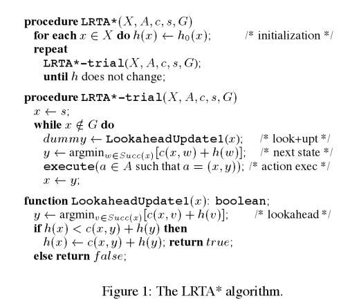
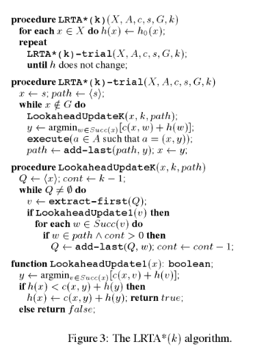

[](https://classroom.github.com/a/LusBoTht)
# COMP90054 AI Planning for Autonomy - Assignment 1 - Search 

You must read fully and carefully the assignment specification and instructions detailed in this file. You are NOT to modify this file in any way.

* **Course:** [COMP90054 AI Planning for Autonomy](https://handbook.unimelb.edu.au/subjects/comp90054) @ Semester 1, 2025
* **Instructors:** Associate Professor Joseph West and Dr Sarita Rosenstock
> [!IMPORTANT]  
> **Please note that this is a 2-stage assignment, so we have 2 deadlines:**
> * **Code Deadline:** Monday 24th March, 2025 @ 6:00pm 
> * **Self-Evaluation Deadline:** Friday 28th March, 2025 @ 6:00pm (end of Week 4)
* **Course Weight:** 10%
* **Assignment type:** Individual & collaborative (you can work with another student on the code, but submit your own repo and self-evaluation)
* **ILOs covered:** 1, 2, and 3
* **Submission method:** via GitHub using tagging (see [Submission Instructions](#submission-instructions) below for instructions)

The **aim of this assignment** is to get you acquainted with AI search techniques and how to derive heuristics in Pacman.

 <p align="center"> 
    
 </p>

## Ungrading
In COMP90054, we will use ungrading for the coursework component of the subject. Even though we are required to provide a grade out of 100, throughout the assignments, subject staff will not assign grades to anyone. Instead, we will use a combination of techniques that uses each student’s reflection of their own learning to provide grades. 

#### Why use ungrading? 

Who is better at assessing how much a student has leant: the student themselves, or a subject tutor/coordinator? I don’t imagine anyone would disagree that the student does. So why don’t we give students a say? For the coursework component of COMP90054 (assignments 1-3), the model that we employ cedes the power responsibility for monitoring and assessing progress to the students themselves. 

Research shows that grades and rubrics have three reliable effects on students in a class: 
1. they tend to think less deeply; 
2. they avoid taking risks; and 
3. they lose interest in the learning itself, 

We want to encourage the reverse of all three of these effects. 

How will a student know if they are doing well? They will receive feedback on assessment throughout the semester. Feedback will be qualitative with broad ratings: needs further work; good; or outstanding; but these ratings will NOT be used for grading. Our detailed feedback will be focused on your self-evaluation to facilitate and maximise your learning. 

<!--### Contract grading -->

Consider the following:

- You have a good idea of what marks you will get prior to receiving them through our automated tests, this self-feedback approach means that if you want a higher mark, you know what you may have to do.

- Tell us what you tried and didn't work, tell us what you learned while coming up with the solution, tell us why your solution doesn't pass a test, and how you would fix it if you had more time. All this reflection and evaluation gives us better tools to assess your learning and provide you with useful feedback.

- Since the assessment is self-directed, you understand well what your code is meant to do and the important lessons you acquired and want to convey with your code to us. It's easier for you to spend 10 - 20 hours with your code and come up with a comprehensive assessment than one tutor to do this for 30 - 50 students.

Some of the possible reasons for mark misalignment of ungrading:

- You're applying the knowledge you've learned to the task, *it is possible you've missed something critical*, even if you receive feedback about your assignment, the level of importance of each error or issue may not be clear. 

- *Perception of feedback length vs lost marks*. Contrast how seeing you lost 2 marks for returning suboptimal solutions suggests it is very wrong even with a small bit of feedback, and how seeing two pages of comments for improvements but no mark deduction suggests that there's lots to improve, but the quality of your solution is still ultimately good for someone early on their AI journey. Concentrate on the feedback. As a rule of thumb, give a good overview of your learning in your self-evaluation, It will significantly help tutors to provide feedback on your learning, which is what you want at this stage.

- In the ungrading process, *you'll likely need to develop methods for verifying the correctness of your results*, not relying only on the more centralised and inflexible nature of automated tests approach. This is often extremely valuable in and of itself, as it forces you to design tests for your code, a vital principle in code development. That said, the centralised automated tests should give you a grounding sense of the correctness of your code.

#### Length of the Self-Evaluation

There's a tendency to conflate writing a lot for the self evaluation as being positive. On the contrary, be concise, and to the point. Practice your ability to synthesise important information, it is important for your communication skills. A self-assessment can be short AND good. There is no need to write pages of text -- just justify why you did a good job and learnt things. 

#### Final words (about ungrading)
The objective is to reflect on your own learning, and take more risks, as you can justify it in your evaluation. In our positive experience with ungrading last semester in COMP90054, and corroborated by [research](https://www.jessestommel.com/how-to-ungrade/) (see bibliography, e.g. [Teaching more by grading less](https://www.lifescied.org/doi/full/10.1187/cbe.cbe-14-03-0054)), reasons people liked ungrading are chiefly:

- Independence and autonomy: people felt more responsible for their own learning and appreciated the additional autonomy and independence that ungrading provided.

- Reduced the stress of trying to get everything right and figure out what the staff wanted to see.

- Allowed people to explore and take a few more risks, because if they failed, learning still occurred.


#### Collaboration
Assignment 1 can be completed individually or in pairs. We encourage pairs to work together to learn from each other; not to simply split the tasks for efficiency. But we will not monitor this – it is your responsibility. You can submit different solutions, we just want to encourage collaboration.

<!-- Each submission will contain an individual short self-reflection. -->
For students who work in pairs, you must still submit an individual self evaluation. In addition, you can either submit the same coding solution (both students still need to submit in their own repo using the appropriate tag), or submit a different coding solution. 

We encourage students to derive their own tests and share them with others to help with learning.

## Your tasks


Since the purpose of assignments is to help you learn more, marks should not be assigned only on whether your code passes a few test cases but also on how much you have learnt.

Who knows better about whether you have learnt from this assignment other than yourself? We ask you to evaluate your work.

Each submission will contain a short self-reflection on what you learnt, how you approached the tasks (including writing new tests) and will give you a chance to argue that, even though you may not have completed a task, how you tried and learnt from it.

More generally, In the past we saw several people either not submitting a self evaluation or not really taking the time to reflect on their learning. In this assignment, we make the expectations clearer: **students are not only marked based on the code performance, but also their self evaluation.**

<!-- We will provide the feedback of your code, which from running the autograder on the server.  -->
Your task contains programming excercises with increasing difficulty. This is where we give students control over how much assessment they want to complete or have the time to complete.
* [Programming Code Performance (7 marks)](#programming-tasks):
    *  [Practice](#practice)
    *  [Part 0 (0 marks)](#part-0-0-mark-but-critical)
    *  [Part 1 (2 marks)](#part-1-2-marks)
    *  [Part 2 (3 marks)](#part-2-3-marks)
    *  [Part 3 (2 marks)](#part-3-2-marks)
* [Self Evaluation Quality (3 marks)](#self-evaluation-task-3-marks)
* [Submission Instruction](#submission-instructions)


<!-- If you want to provide a report with your submission (e.g., reflections, acknowledgments, etc.), please do so in file [REPORT.md](REPORT.md). -->
### Programming Tasks:

You **must build and submit your solution** using the sample code we provide you in this repository, which is different from the original [UC Berkley code base](https://ai.berkeley.edu/search.html). 

* You should **only work on and modify** the file [search.py](search.py) in completing your solution. Do not change the other Python files in this distribution.

* Your code **must run _error-free_ on Python 3.8**. Staff will not debug/fix any code. Using a different version will risk your program not running with the Pacman infrastructure or autograder. 

* Your code **must not include any personal information**, like your student number or your name. If you use an IDE that inserts your name, student number, or username, you should disable that.

* **Assignment 1 FAQ** is available to answer common questions you might have about [Assignment 1 FAQ on ED](https://edstem.org/au/courses/22014/discussion/2475721)

* **Getting started on GitHub** - the video below explains how to **clone**, **git add**, **commit** and **push** while developing your solution for this assignment:

[](https://www.loom.com/share/ae7e93ab8bec40be96b638c49081e3d9)

#### Setting up the environment

* You can set up your local environment:
    * You can install Python 3.8 from the [official site](https://peps.python.org/pep-0569/), or set up a [Conda environment](https://www.freecodecamp.org/news/why-you-need-python-environments-and-how-to-manage-them-with-conda-85f155f4353c/) or an environment with [PIP+virtualenv](https://uoa-eresearch.github.io/eresearch-cookbook/recipe/2014/11/26/python-virtual-env/). Please check [Conda Run](#conda-run) to set up the conda environment.
    * You need to install an additional package (func_timeout) using: `pip3 install func_timeout`

* Alternatively, you can use docker:
    * You need to install docker from the [official site](https://docs.docker.com/get-docker/)
    * Please check [Docker Run](#docker-run) to run your code.
> [!TIP] 
> Furthermore, if you would like to visualise your result, you may need to install python package **tkinter**: Run the following command ``pip install tk`` 


#### Practice

To familiarise yourself with basic search algorithms and the Pacman environment, it is a good start to implement the tasks at https://ai.berkeley.edu/search.html, especially the first four tasks; however, there is no requirement to do so.

You should code your implementations *only* at the locations in the template code indicated by ```***YOUR CODE HERE***``` in files [search.py](search.py), please do not change code at any other locations or in any other files.

> [!TIP]
> You can use the `autograder` file locally to get feedback about your progress. The test cases are included in the test_cases subfolder. You can create your own tests too! Note that the autograder does not necessarily reflect your grade. We will also host an extra hidden set of test cases in a folder called test_cases_assignment1 in our online autograder that we will release after you have submitted your solution. You will then have time to reflect on your learning through the self-evaluation and the new hidden cases. 
#### Part 0 (0 mark, but critical)


This is a great way to test that you understand the submission instructions correctly, and how to get feedback from our hidden test-cases as many times as you want. Here are the steps:

1. Complete [this form](https://forms.gle/GnuRYXyTLqPGTgyH9) to register your GitHub account with your student ID.
2. Please tag your solution with `test-submission`. If you are not familiar with tags, please check out [tag hints](#git-hints-on-tags)
3. We are going to run your code on our server. You can check your result from this [webpage](https://tinyurl.com/comp90054-2025s1) after a few minutes. This can test your code for part 1, part 2 and part 3.

#### Part 1 (2 marks)

Pac-Man is a classic game that has taken the world over for decades, and the Pac-Man food problem is exactly the scenario we need to consider for this assignment. Consider that we are a pacman agent that is navigating a maze in order to eat all of the food particles scattered throughout the maze. The agent's goal is to devise an efficient strategy to eat all the food while minimizing the time or steps taken. In this process, the agent must explore and make decisions based on the current state of the environment.

In the Pac-Man food problem, the agent (Pac-Man) starts at a specific location in a maze and must find a path to eat all the food. The difficulty of the problem lies in navigating the maze structure, avoiding dead ends, and ensuring that all food particles are eaten in the shortest possible time. This can be formalized as a search problem whose goal state is that no food particles remain.

To solve the food problem efficiently, we need to design a heuristic function (for the given A*) that guides the search algorithm effectively towards the goal state. This heuristic function should estimate the cost from the current state to the goal state and help prioritize which paths the agent should explore first. A good heuristic must be both admissible and as close to the optimal heuristic function as possible. 


>[!TIP] 
> You can implement other helper classes/functions. 

> [!Note]
> You don't have to implement A* Algorithm, as this has already been implemented for you in the codebase. Make sure A* calls the heuristic you implemented. You should be able to test the algorithm using the following command:

```
python pacman.py -l mediumMaze -p SearchAgent -a fn=astar,prob=FoodSearchProblem,heuristic=foodHeuristic
```
>[!IMPORTANT] 
> Please do not change the arguments used above, unless you want to test a different functionality :wink:. You can explore other options via ``python pacman.py -h``. 

We have provided a local autograder to test your code locally ([Local Autograder](#local-autograder)).

For Part 1, the `autograder` seeks an optimal solution length within the time budget (**10 seconds**) for each test case. 
And please be aware that total search time is influenced not only by the number of nodes expanded but also by the complexity of the heuristic function (the time required to compute it). 

And the node expansion number will directly impact your result, please inspect the result from `autograder` for further thresholds information. In addition, please make sure your heuristic is **admissible**, otherwise you may not get full marks for this part due to not finding the optimal plan.


You will experience first-hand the balance between 1) how informed you make your heuristic (it should expand less nodes in general), and 2) the overall runtime. As you can see, sometimes it may be preferable to have a cheaper, less informed heuristic, even if you end up expanding more nodes.

Other layouts are available in the [layouts](layouts/) directory, and you can easily create you own.  
#### Part 2 (3 marks)

So far in this subject we have covered **offline** search, where a search algorithm has access to the entire environment and finds a complete path to the goal before any actions are actually executed. If the environment is not fully known in advance, or it is changing as the agent acts, it is important to search in an **online** manner; choose an action and execute it, then see what happens and choose the next action. This has close ties to reinforcement learning, which will be covered in the second half of the subject, but for now, we will only concern ourselves with online planning.

One popular algorithm for online planning is **Learning Real-time A\*** (or LRTA*), which (along with some extensions) has been used in games like Dragon Age: Origins, Baldur’s Gate, and Age of Empires. At a high level, LRTA* combines the heuristic-guided search approach of A* with real-time learning capabilities in a greedy fashion. The algorithm works by repeatedly doing the following:

1. Look ahead to evaluate a limited set of possible next states (typically direct neighbors)
2. Update the heuristic value of the current state based on information gained from this lookahead
3. Move to the most promising neighbor
4. Repeat until reaching the goal

As the agent moves through the environment, it continuously updates its heuristic estimates, effectively "learning" about the environment through experience. This learning component allows the agent to improve its performance over time when solving similar problems repeatedly.

LRTA* has a number of important properties:
 - Given a set of reasonable assumptions (e.g. there are no 'dead-ends' in the graph, and all edges have positive cost), LRTA* will always find a solution to the goal. 
 - With an admissible heuristic and the above assumptions, LRTA* will eventually learn a perfect heuristic along every optimal path to the goal.
 - LRTA* can find a suboptimal solution quickly, but then make use of additional computation time by incrementally improving its solution. 

A key advantage of LRTA* is that it can operate with limited computational resources per step, making decisions in bounded time while still eventually converging to optimal solutions when run multiple times in the same environment. This makes it particularly well-suited for applications like video games, where agents need to make quick decisions while adapting to partially known or changing environments.

> [!NOTE]
> You can check more details in this [paper: LRTA*(k)](https://www.ijcai.org/Proceedings/05/Papers/0764.pdf), which provides a succinct summary of LRTA* before expanding on it with a generalised (and often more efficient) variant. 


<!-- >[!IMPORTANT]
> **The Output** should be a dictionary containing the path for each pacman as a list `{pacman_name: [action1, action2, ...]}`. -->




Implement the **LRTA\* algorithm** discussed above by inserting your code into the template indicated by comment ```*** YOUR CODE HERE FOR TASK 2 ***```, you can view the location at this link: [search.py#L155](search.py#L155). 

There are two components to implement:
 - `lrtaStarTrial`: this performs a single trial, and returns the path found.
 - `lrtaStarSearch`: this performs a sequence of trials until there are no further updates to the heuristic values, and should only return the optimal path found by the last trial. This function should call `lrtaStarTrial`

We strongly recommend you use the provided `LearningHeuristic` class to simplify implementation of the algorithm. This will help reduce the amount of overhead that needs to be passed between `lrtaStarTrial` and `lrtaStarSearch`. It is not mandatory though, and you are welcome to use your own implementation if you would prefer.

You can test your agent by running the local autograder: 
```bash
python autograder.py --test-directory=test_cases_assignment1 --q part2
```

>[!IMPORTANT]
> Following the pseudocode literally may result in failing the test cases for two reasons:
> 1. You have higher numbers of node expansions than the solutions. In particular, you may see every node expanded twice. 
> 2. The test cases assume that ties are broken in the order that nodes are generated, not randomly. 
> 
> If you do not perfectly match the node expansions, but have good reason to believe your algorithm is correct, you can discuss this in your self-evaluation.


You can visualize the path of your agent by using the following command:
```bash
python pacman.py -l tinyCorners -p SearchAgent -a fn=lrta,prob=FoodSearchProblem,heuristic=foodHeuristic
```

You can also visualise the path of the intial trial of your agent by using this alternate command:
```bash
python pacman.py -l tinyCorners -p SearchAgent -a fn=lrtaTrial,prob=FoodSearchProblem,heuristic=foodHeuristic
```

<!-- 
You can visualize the path of your agent by using the following command"
```bash
python pacman.py -l mapfTest -p SearchAgent -a fn=lrta,prob=MAPFProblem
```
You can also create your own layout files in the `layouts` directory and changed the `-l` argument in the above command.

We have a local autograder to test your code locally ([Local Autograder](#local-autograder)).

For task 2, `autograder` checks for the optimal solution length and soundness of your solution. 

> **Optional**
> We encourage you to test your submission locally with your own layouts by editing `test_cases_assignment1/part2/cbs_test.test`. And we enourage you to share new layouts publicly in this [ED Megathread](https://edstem.org/au/courses/17752/discussion/2097066) to enable other students to test their submissions on these layouts as well. You can start threads to discuss and compare performance with other students. -->

#### Part 3 (2 marks)
LRTA* can be very slow to converge if the heuristic heavily underestimates the true cost. Why? Try running the following command and count the number of iterations taken to converge. 

```bash 
python pacman.py -l tinyCorners -p SearchAgent -a fn=lrta,prob=FoodSearchProblem,heuristic=nullHeuristic
```

Fundamentally, the heuristic is slow to update: if you think of the heuristic as a surface, with the values corresponding to the height of the surface, an area with heavily underestimated values forms a big hole. As a greedy algorithm, LRTA* always goes to the bottom of any nearby hole, so LRTA* wanders around for a long time, updating single states individually by small amounts until it has 'filled in' the hole. 

There are many extensions to LRTA* which try to address this limitation by expanding the number of states which get updated at each step. For this question, you will implement LRTA*($k$), which is a variant which updates up to $k$ states at each time period. Pseudocode for the algorithm is given in the figure below, and for more details, check [the paper](https://www.ijcai.org/Proceedings/05/Papers/0764.pdf).



As before, implement both `lrtakStarTrial` and `lrtakStarSearch` functions.

You can test your agent by running the local autograder: 
```bash
python autograder.py --test-directory=test_cases_assignment1 --q part3
```

You can see the improvement in convergence by using the following command:
```bash 
python pacman.py -l tinyCorners -p SearchAgent -a fn=lrtak,prob=FoodSearchProblem,heuristic=nullHeuristic
```

>[!IMPORTANT]
> As in the prior question, the test cases are sentitive to implementation details in your algorithms. Try to eliminate duplicate expansions and match the tie-breaking behaviour, but justifiable deviations from the test cases are OK, and should be discussed in your self-evaluation.


### Self Evaluation Task (3 Marks)
We highly recommend updating the self-evaluation as you complete each part, as you'll have fresh in your mind the learning lessons you acquired. Treat the self-evaluation as a [living document](https://en.wikipedia.org/wiki/Living_document). 

At the end, it is recommended that you look at the full learning journey you had across the assignment. Once you submit your final code, We will disclose the hidden tests used for automated feedback, so you can incorporate their analysis into your self-evaluation.  

You need to assign your marks for part 1 (2 marks), part 2 (3 marks), and part 3 (2 marks) based on your code performance due to your programming, and learning experiences. Consider aspects such as coding lessons/challenges, heuristic properties, search algorithms subtleties, what would you have done if you were to have more time, etc.


## Marking criteria

Marks are given based on both your code performance and your self evaluation. We are going to review your self evaluation and give you feedback about it, but we won't focus on the marks, rather on your qualitative evaluation.
 
You must **follow good SE practices**, including good use of git during your development such as:

* _Commit early, commit often:_ it is not good practice to make a single commit with all of the solution nor is it good practice to make very few commits each with big chunks of it.
* _Use meaningful commit messages:_ like comments in your code, the message should clearly summarise what the commit is about. Messages like "fix", "work", "commit", "changes" are poor and do not help us understand what was done.
* _Use atomic commits:_ avoid commits doing many things; let alone one commit solving many questions of the project. Each commit should be about one (little but interesting) thing. 

> [!CAUTION]
> We will revise marks up or down if they are strongly uncalibrated. That said, in our experience, this is the exception rather than the rule.

If you are new to [GIT, check out this 100 seconds video summary](https://www.youtube.com/watch?v=hwP7WQkmECE) and read this [online book section about version control](https://cis-projects.github.io/project_based_course_notes/topics/version_control.html) developed by the [team](https://github.com/cis-projects/project_based_course_notes) running the software project in CIS.

## Checking your submission

<!-- **NOTE**: You should not change any files other than [search.py](search.py). You should not import any additional libraries into your code. This risks being incompatible with our running scripts. -->

> [!NOTE]
> From this repository, we will copy *only* the file: [search.py](search.py) when testing using the autograder on the server, which will be selected via tagging. Please do not change any other file as part of your solution, or it will not run on our server.

### Local Autograder
There is a **local autograder** provided to you to help you gain more insights. You may run the following command to test out your code for all three tasks.
```
python ./autograder.py --test-directory=test_cases_assignment1
```

It is important that you are able to run the autograder and have these tests pass, as this gives you valuable feedback about the validity of your solution. However, a full mark result in the local autograder does not imply that you would receive a full mark on the server. There might be two reasons:
* Runability (Your code might not be able to run successfully if you have extra `import`s), you can test with the docker as instructed in the section below.
* Hidden test cases. We have hidden test cases on the server, which should have similar scale to the local tests, but might have more tricky layouts.


> [!NOTE]
> We encourage you to create and share your own test cases, you can create them following a similar style to those we provided in [test_cases_assignment1/](test_cases_assignment1/). Please feel free to share your test cases in this [ED post](https://edstem.org/au/courses/22014/discussion/2469788).

## Conda Run
To set up a conda environment locally, execute this command
```
conda env create -f conda/environment.yml
```
Then, activate the environment
```
conda activate 2025s1a1
```

## Docker Run
If you prefer not to set up your environment locally, you can run your code with docker. First, initialise docker
```
bash ./docker/docker_init.sh
```

An example command for running the autograder is (please change the `bash` to `sh` if you are using Windows PowerShell):
```
bash ./docker/docker_runner.sh python ./autograder.py --test-directory=test_cases_assignment1
```

You can use a similar command to test individual each individual part. However, Docker does not support GUI without additional setup, so please make sure you add the `-t` option when testing each individual part.
```
bash ./docker/docker_runner.sh python pacman.py -l mediumMaze -p SearchAgent -a fn=astar,heuristic=nullHeuristic -t
```

## Submission Instructions

This repository serves as base code for you to carry out your solution for [Project 1 - Search](http://ai.berkeley.edu/search.html) from the set of [UC Pacman Projects](http://ai.berkeley.edu/project_overview.html) and the marked questions. 

**To submit your assignment** you must complete the following **four** steps:

1. Check that your solution runs on Python 3.8 and that your source code does not include personal information, like your student number or name. 
2. Tag the commit that contains your final code with tag `submission`. 
    * The commit and tagging should be dated before the deadline.
    * Note that a tag is **NOT** a branch, so do not just create a branch called "submission" as that will not amount to tagging.
    * Note that a tag is **NOT** a commit message, so please make sure you can find it in your repo page -> tags.
    * It is **case-sensitive**.
3. Complete the self-evaluation of your work and submit to [Canvas -> Assignments -> (Assignment1)](https://canvas.lms.unimelb.edu.au/courses/211178/assignments/548325). You can use [SELFEV.md](SELFEV.md) as a template or guide for your self evaluation.
4. **Make sure you fill in the [submission certification form](https://forms.gle/YLHnh86ymhkqCwgJ6)**.
<!-- 4. Fill the [Assignment 1 Certification Form](https://forms.gle/3W8ntjbW6Qq6NMvZA). -->


> [!Warning]
>Non-certified submissions will attract **zero** marks.
    


<!-- From this repository, we will copy *only* the files: [search.py](search.py). Please do not change any other file as part of your solution, or it will not run. Breaking these instructions breaks our marking scripts, delays marks being returned, and more importantly, gives us a headache. Submissions not compatible with the instructions in this document will attract zero marks and do not warrant a re-submission. Staff will not debug or fix your submission. -->
The reason why we ask you to follow this process is to make sure you know how the final project/competition submission system will work. 

Please view the following to learn how to *Tag* your commit version you want to be graded:


### Git hints on tags:
**How to create a Tag using the Command Line**:


[](https://www.loom.com/share/17ec72b954454bc89bbe1dbb0bd2874f)

**Another way to create a Tag using the User Interface**:

[](https://www.loom.com/share/3cd39e97919e4b688d9841613aba6973)

## Important information

**Corrections:** From time to time, students or staff find errors (e.g., typos, unclear instructions, etc.) in the assignment specification. In that case, corrected version of this file will be produced, announced, and distributed for you to commit and push into your repository. Because of that, you are NOT to modify this file in any way to avoid conflicts.

**Late submissions & extensions:** A penalty of 10% of the maximum mark per day will apply to late assignments up to a maximum of five days, and 100% penalty thereafter. Please include the late penalty in your mark if you do a late submission. Extensions will only be permitted in _exceptional_ circumstances; refer to [this question](https://docs.google.com/document/d/17YdTmDC54WHq0uZ-2UX3U8ESwULyBDJSD4SjKCrPXlA/edit?usp=sharing) in the course FAQs. 

**About this repo:** You must ALWAYS keep your fork **private** and **never share it** with anybody in or outside the course, except your teammates, _even after the course is completed_. You are not allowed to make another repository copy outside the provided GitHub Classroom without the written permission of the teaching staff. Please respect the [authors request](http://ai.berkeley.edu/project_instructions.html): 

> **_Please do not distribute or post solutions to any of the projects._**

**Academic Dishonesty:** This is an advanced course, so we expect full professionalism and ethical conduct.  Plagiarism is a serious issue. Please **don't let us down and risk our trust**. The staff take academic misconduct very seriously. Sophisticated _plagiarism detection_ software (e.g., [Codequiry](https://codequiry.com/), [Turinitin](https://www.turnitin.com/), etc.) will be used to check your code against other submissions in the class as well as resources available on the web for logical redundancy. These systems are really smart, so just do not risk it and remain professional. We trust you all to submit your own work only; please don't let us down. If you do, we will pursue the strongest consequences available to us according to the **University Academic Integrity policy**. If you collaborate with other students, or use other materials, make sure to **acknowledge it in your self evaluation**. For more information on this see file [Academic Integrity](ACADEMIC_INTEGRITY.md).

**We are here to help!:** We are here to help you! But we don't know you need help unless you tell us. We expect reasonable effort from your side, but if you get stuck or have doubts, please seek help. We will run labs to support these projects, so use them! You can always ask general questions about the techniques that are required to solve the projects. If in doubt whether a questions is appropriate, always feel free to post a Private post to the instructors on Ed.

**Silence Policy:** A silence policy will take effect **48 hours** before this assignment is due. This means that no question about this assignment will be answered, whether it is asked on the discussion board, by email, or in person. Use the last 48 hours to wrap up and finish your project quietly as well as possible if you have not done so already. Remember it is not mandatory to complete the project by reaching a perfect state, try to cover as much as possible. By having some silence we reduce anxiety, last minute mistakes, and unreasonable expectations on others.

Please remember to follow all the submission steps as per the assignment specification.

## COMP90054 Code of Honour

We expect every UoM student taking this course to adhere to it **Code of Honour** under which every learner-student should:

* Submit their own original work (done individually or in their pair), or acknowledge the sources used.
* Do not share solutions with others, but provide instead insights to help others learn.
* Report suspected violations.
* Do not engage in any other activities that will dishonestly improve their results or dishonestly improve or damage the results of others.

Unethical behaviour is extremely serious and consequences are painful for everyone. We expect enrolled students/learners to take full **ownership** of your work and **respect** the work of teachers and other students.


**I hope you enjoy the assignment and learn from it**, and if you still **have doubts about the assignment and/or this specification** do not hesitate to ask in the [ED discussion Forum](https://edstem.org/au/courses/22014/discussion/) and we will try to address it as quickly as we can!

**GOOD LUCK and HAPPY PACMAN!**

## Acknowledgements

This is adapted from [Project 1 - Search](http://ai.berkeley.edu/search.html) from the set of [UC Pacman Projects](http://ai.berkeley.edu/project_overview.html).  We are very grateful to UC Berkeley CS188 for developing and sharing their system with us for teaching and learning purposes.
