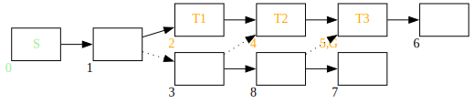
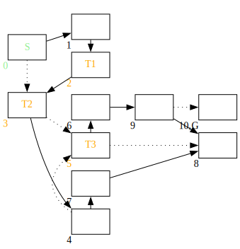
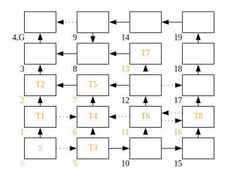
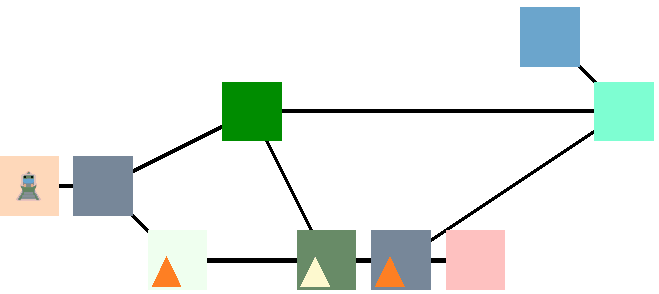

# COMP90054 AI Planning for Autonomy - Project 2 - PDDL modelling 

You must read fully and carefully the assignment specification and instructions detailed in this file. You are NOT to modify this file in any way.

* **Course:** COMP90054 AI Planning for Autonomy @ Semester 1, 2025
* **Instructors:** Associate Professor Joseph West and Dr Sarita Rosenstock
* **Deadline:** Wednesday 16th April, 2025 @ 18:00 (middle of Week 7)
* **Course Weight:** 10%
* **Assignment type:** Individual
* **ILOs covered:** 1, 2, and 3
* **Submission method:** Canvas submission (see Submission Instructions below for instructions)
* **Extensions:** For extension applications, email Joe. He will ask you to consider whether an extension is really a good idea, as it is likely to impact other assessments. If an extension is not a good option, try to do what you can and let us know about your work and learning in the self-evaluation.

The **aim of this project** is to improve your understanding of PDDL modelling.

> [!WARNING]
> The assignment has a final deadline for both Code and Self Evaluation, but there is an expectation that you attempt to complete your solution to the problem before **Monday 13th April**, and complete your Self Evaluation following the release of the solution. You will need to mark your Code as completed prior to looking at the Solution as in Assignment 1.

## (Un)grading
Assignment 2 will use ungrading the same way that Assignment 1 did. The feedback was on the whole very positive. We'll provide an announcement on Ed soon regarding the feedback we received which may help navigate Ungrading for Assignment 2. Similarly, once the marks are prepared for Assignment 1, we will provide some feedback on the discussion forum regarding any misalignments that appear systematic (and hence potentially correctable). For the most part, reading and responding to all the guiding questions in the self evalutation document should keep your response in the right area for what we're looking to understand.

<!-- 
Based on Assignment 1 feedback from this semester, a majority of people preferred self-grading (**73.1%**), with about **26.9%** prefering traditional grading. Though **91.0%** of people felt it improved their learning experience. The main reasons people disliked ungrading this semester were:

1. Concern about the impact of the a less effective self-reflection on marks (negatively) where the work is successful.
    
    This is fairly common as a concern, we're still working on marking Assignment 1 so can't provide statistics on how common revising a mark is, but usually this is rare if the self-reflection has been earnestly carried out. In theory, a poorly reflective piece which doesn't demonstrate understanding might lose marks, and in an ideal world we would ask for a further submission from those who do not complete this sufficiently well. In practice, this is difficult to arrange simply because the Assignment 1 deadline is close enough to the release of Assignment 2 that the feedback loop cannot easily complete. Still, should the mark you receive not match your expectations, there are still avenues for you to discuss your justification with a marker.

2. Because the criteria was more flexible, the autograder did not accept some reasonable and justifiably correct options.

    This is a challenge of ungrading that there is not a better solution for than peer-sharing of testing. Automated feedback is necessarily limited in scope to what it was programmed to test. Approaches which do not follow an intended path to the letter are worthwhile exploring, but do not lend themselves well to a single set of automated tests. The more accepting the criteria are, the less likely it is that a pre-provided automated test suite can capture success directly. For example, a result which expands nodes twice as often as it follows the pseudocode more closely might be easily justified, but doubles the number of expansions along valid paths and may validate errors as successful attempts where the doubling is unintended by the code writer. Manually validated paths could be added to the local autograder to check these, but the reality is simply that with a less rigid task, not all approaches can or necessarily should be caught by provided tests by default. If you are someone who takes an alternative approach, consider providing your alternative tests on Ed with information on what they are testing - this is mostly how the simultaneously broad acceptance of answers and the narrow testing to capture errors along different acceptable paths is ideally meant to go. If there are barriers to doing this, or it isn't clear that we hope to see this - let us know!

There were many reasons people liked ungrading, chiefly:

1. Liked how the ungrading approach aligned with how the subject is taught.
2. It was helpful in digesting learning. Helping to think through what had been done and why it had been done.
3. Reduced the stress of trying to get everything right and figure out what the staff wanted to see.
4. Allowed people to explore and take a few more risks, because if they failed, learning still occurred.
5. Independence and autonomy: people felt more responsible for their own learning and appreciated the additional autonomy and independence that ungrading provided.
6. The self-direction made it easier to be motivated to try more and focus more on learning than passing test cases.

    These are all intended outcomes of the ungrading process, so it is very heartening to see that people found it delivered on those promises.

There were also some additional positive but critical views on ungrading:

1. There was still a pressure to reach 100% because scores were displayed.
2. The process being new made it stressful even if more useful.
3. The self-reflection process takes more time even though it does help a lot with learning.

    These are fairly common feelings, learning is often challenging and knowing precisely what mark you intend to give yourself for the work you've done doesn't necessarily relieve any pressure if you think that mark should be low where you are now. These views were still positive about the Ungrading process as the aim of the assignment is to learn, but some elements, such as the time committed to the assignment, can sometimes be alleviated by utilising the ungrading process more heavily by targeting the intended outcomes and dedicating an appropriate share of the intended time to each element. But the reality is a "Turn your brain off and code" assignment will tend to be less intense than one that asks you to think about what you've actually done. Likewise, the process being new is a challenge that is only solved by greater adoption.

-->

## Task

**Your task** is to read the description of the domain below and encode the three planning problem instances. You can use the provided templates in this repository in the folder [pddl_template](pddl_template). Finally, you will be asked to explain and show how you would extend your solution to deal with an updated domain specification.

## The Domain - City Tram Scheduling

*Help everyone catch the Route S tram to University!*
 
The city is undergoing a large amount of construction and hopes to revitalise its tram network with a brand new set of rails. But due to a scandal embroiling both the middle and upper management of Darling Trams, no routes or scheduling for the trams has been carried out and all trams are in chaos.

At 8am on Monday, the Route S tram is set to leave from outside your house and take you to the University's tram stop. With the Monday AI Lecture to get to, the tram will need your help to get you to class.

Here are the basic facts about the tram scheduling problem domain:
- The city is simplified into **track** segments.
- Each track can be **connected** to one or more **destination** track segments, though they will connect to at most one **switched** destination track at a time. The switched destination track is the track segment that trams on the track segment will proceed to when moving.
- Each track may have a **tram** on it, or may be empty.
- One of the **track** segments is the goal for the Route S tram (the university).
- One of the **track** segments starts with the **Route S tram** on it.

Despite the management meltdown, the operations centre provides the Route S tram with the status of all tracks and trams. The tram also has special priveliges that are not normally given to tram drivers when everything is working well such as picking its own route and asking powered trams to advance. If the Route S traverses the same track multiple times, the driver will lose faith in your directions, so once the tram leaves a track, it cannot be visited again.

<!--
A hero woke up in a dungeon full of monsters and traps (perhaps the party last Night went wrong...) and needs your help to get out.  Here are basic facts for the dungeon domain:
- The dungeon contains rooms that are **connected** by corridors (dungeon can thus be represented by undirected graph)
- each room can be **empty**, or can have a **monster** in it, or can have a **trap** in it, or can have a **sword** in it
- one of the empty rooms is the **goal**: it has an exit, so the hero can escape

The hero is lucky since she/he has full knowledge about the dungeon. But not that lucky – just after the hero leaves each room s/he visits, the room is **destroyed** and cannot be visited again.

-->

The tram driver can perform the following actions - but only if the Route S tram is still powered!

- The Route S tram can **move** to the next track from its current track.
- The Route S tram can **switch** a track from one of its destination tracks to another destination track.
- The Route S tram can **request** a tram on the track of its current destination track to move to its following track - but only if that tram is **powered**.

However, the driver must be careful:

- If a tram **moves** to a track which already contains a tram, that tram becomes **unpowered** instead of making the move. This includes the Route S tram!
- If a tram which is unpowered receives a **request**, it will not action that request.

<!-- The hero can perform the following actions – but only if s/he is alive!
- The hero can **move** to an adjacent room (connected by a corridor) that has not been destroyed (i.e., the hero has not already visited the room)
- **Pickup** the sword if present in the room the hero is currently in and the hero is empty handed
- **Destroy** the sword that the hero currently holds. However, this can have unpleasant effects if done in a room with a trap or a monster: it triggers the trap or invites the monster to eat the hero.
- **Disarm a trap** – if there is a trap in the room the hero is in and the hero is empty-handed (does not hold a sword), then the hero can disarm it

However, there are some (dangerous) constraints the hero has to consider:
- If the hero enters a room with a monster in it, s/he has to carry a sword (so the monster is afraid of him/her), otherwise the monster kills him/her. Notice that the hero is pacifist, so s/he cannot kill the monster.
- If the hero destroys the sword in a room with a monster in it, the monster kills him/her as well.
- The only action the hero can safely perform in a room with a trap in it is the **disarm a trap** action. Any other action (even moving away) triggers the trap which kills the hero.

-->

**Important:** We recommend reading the description carefully several times to make sure you fully understand it before starting coding in PDDL.

### Problem 1

The problems are specified such that rectangles stand for track segments and edges between them represent possible destinations, with dotted lines signifying a non-switched destination track. **S** is the Route S tram's initial position, **G** is annotated as the desired goal position, **$T_i$** indicates a tram. The numbers identify a unique ID for each track segment. Good luck!

<!--

digraph G {
    node[shape="rectangle"]
    rankdir=LR;
    track_0 [xlabel="0", label="S", fontcolor="lightgreen"];
    track_1 [xlabel="1", label=""];
    track_2 [xlabel="2", label=<T1>, fontcolor="orange"];
    track_3 [xlabel="3", label=""];
    track_4 [xlabel="4", label=<T2>, fontcolor="orange"];
    track_5 [xlabel="5,G", label=<T3>, fontcolor="orange"];
    track_6 [xlabel="6", label=""];
    track_7 [xlabel="7", label=""];
    track_8 [xlabel="8", label=""];
    
    track_0 -> track_1;
    track_1 -> track_2;
    track_1 -> track_3 [style="dotted"];
    track_2 -> track_4;
    track_3 -> track_4 [style="dotted"];
    track_3 -> track_8;
    track_8 -> track_7;
    track_8 -> track_5 [style="dotted"];
    track_4 -> track_5;
    track_5 -> track_6;
}

-->

A sample plan for this problem instance would look like:
1. (move track0 track1)
2. (switch track1 track2 track3)
3. (move track1 track3)
4. (move track3 track8)
5. (switch track8 track7 track5)
6. (request track8 track5 tram3 track6)
7. (move track8 track5)

<!-- 
1. (move cell5 cell4)
2. (pick-sword cell4 sword1)
3. (move cell4 cell3)
4. (move cell3 cell7)
5. (destroy-sword cell7 sword1)
6. (move cell7 cell6)
7. (move cell6 cell2)
8. (disarm-trap cell2)
9. (move cell2 cell1)
-->

> [!Tip]
> **Please note, each action's name and its parameters are just examples, the plan will vary based on your implementation.**

### Problem 2

<!--

digraph G {
    node[shape="rectangle"]
    rankdir=LR;
    track_0 [xlabel="0", label="S", fontcolor="lightgreen"];
    subgraph cluster_vert1 {
        style=invis;
        rankdir=TB;
        track_1 [xlabel="1", label=""];
        track_2 [xlabel="2", label=<T1>, fontcolor="orange"];
        track_3 [xlabel="3", label=<T2>, fontcolor="orange"];
        {track_1 -> track_2; rank=same}
        {track_2 -> track_3; rank=same}
    }
    subgraph cluster_vert2 {
        style=invis;
        rankdir=TB;
        track_4 [xlabel="4", label=""];
        track_5 [xlabel="5", label=<T3>, fontcolor="orange"];
        track_6 [xlabel="6", label=""];
        {track_4 -> track_5 [style="dotted"]; rank=same}
        {track_4 -> track_7; rank=same}
        {track_5 -> track_6; rank=same}
    }
    
    track_7 [xlabel="7", label=""];
    track_8 [xlabel="8", label=""];
    track_9 [xlabel="9", label=""];
    track_10 [xlabel="10,G", label=""];
    
    track_0 -> track_1;
    {track_0 -> track_3 [style="dotted"]; rank=min};
    
    track_3 -> track_4;
    track_3 -> track_5 [style="dotted"];
   
    track_5 -> track_8 [style="dotted"];
    track_6 -> track_9;
    track_7 -> track_8;
    track_9 -> track_8;
    track_9 -> track_10 [style="dotted"];
    
}

-->

A sample plan for this problem instance would look like:
1. (switch track0 track1 track3)
2. (request track0 track3 tram2 track4)
3. (move track0 track3)
4. (switch track3 track4 track5)
5. (request track3 track5 tram3 track6)
6. (move track3 track5)
7. (request track5 track6 tram3 track9)
8. (move track5 track6)
9. (request track6 track9 tram3 track8)
10. (move track6 track9)
11. (switch track9 track8 track10)
12. (move track9 track10)
    
> [!Tip]
> **Please note, each action's name and its parameters are just examples, the plan will vary based on your implementation.**

### Problem 3
<!--

digraph G {
    node[shape="rectangle"]
    rankdir=LR;
    subgraph cluster_vert1 {
        style=invis;
        rankdir=TB;
        track_0 [xlabel="0", label="S", fontcolor="lightgreen"];
        track_1 [xlabel="1", label=<T1>, fontcolor="orange"];
        track_2 [xlabel="2", label=<T2>, fontcolor="orange"];
        track_3 [xlabel="3", label=""];
        track_4 [xlabel="4,G", label=""];
        {track_0 -> track_1; rank=same}
        {track_1 -> track_2; rank=same}
        {track_2 -> track_3; rank=same}
        {track_3 -> track_4; rank=same}
        {track_0 -> track_4 [style="invis"]; rank=max}
    }
    subgraph cluster_vert2 {
        style=invis;
        rankdir=TB;
        track_5 [xlabel="5", label=<T3>, fontcolor="orange"];
        track_6 [xlabel="6", label=<T4>, fontcolor="orange"];
        track_7 [xlabel="7", label=<T5>, fontcolor="orange"];
        track_8 [xlabel="8", label=""];
        track_9 [xlabel="9", label=""];
        {track_5 -> track_6 [style="dotted"]; rank=same}
        {track_6 -> track_7; rank=same}
        {track_7 -> track_8 [style="invis"]; rank=same}
        {track_8 -> track_9 [style="invis"]; rank=same}
        {track_9 -> track_8 [tailport="s", headport="n"]; rank=same}
    }
    subgraph cluster_vert3 {
        style=invis;
        rankdir=TB;
        track_10 [xlabel="10", label=""];
        track_11 [xlabel="11", label=<T6>, fontcolor="orange"];
        track_12 [xlabel="12", label=""];
        track_13 [xlabel="13", label=<T7>, fontcolor="orange"];
        track_14 [xlabel="14", label=""];
        {track_10 -> track_11 [style="dotted"]; rank=same}
        {track_11 -> track_12; rank=same}
        {track_12 -> track_13 [style="dotted"]; rank=same}
        {track_13 -> track_14 [style="invis"]; rank=same}
    }
    subgraph cluster_vert3 {
        style=invis;
        rankdir=TB;
        track_15 [xlabel="15", label=""];
        track_16 [xlabel="16", label=<T8>, fontcolor="orange"];
        track_17 [xlabel="17", label=""];
        track_18 [xlabel="18", label=""];
        track_19 [xlabel="19", label=""];
        {track_15 -> track_16; rank=same}
        {track_16 -> track_17; rank=same}
        {track_17 -> track_18; rank=same}
        {track_18 -> track_19; rank=same}
    }
    
    track_0 -> track_5 [style="dotted"];
    track_5 -> track_10;
    track_10 -> track_15;
    # Horizontal connections non-layout
    track_1 -> track_6 [style="dotted"];
    track_7 -> track_2;
    track_8 -> track_3;
    track_9 -> track_4 [style="dotted", headport="e", tailport="w"];
    track_4 -> track_9 [style="invis"]; # Balance LR edge count.
    track_11 -> track_6 [style="dotted"];
    track_12 -> track_7 [headport="e", tailport="w"];
    track_13 -> track_8 [headport="e", tailport="w"];
    track_14 -> track_9 [headport="e", tailport="w"];
    track_6 -> track_11 [style="invis", headport="ne", tailport="nw"]; # Balance LR edge count.
    track_7 -> track_12 [style="invis", headport="ne", tailport="nw"]; # Balance LR edge count.
    track_8 -> track_13 [style="invis", headport="ne", tailport="nw"]; # Balance LR edge count.
    track_9 -> track_14 [style="invis", headport="ne", tailport="nw"]; # Balance LR edge count.
    # vert2-vert3 non-layout edges
    track_16 -> track_11 [style="dotted"];
    track_11 -> track_16 [style="dotted"];
    track_12 -> track_17 [style="dotted"];
    track_19 -> track_14;
    
}

-->

A sample plan for this problem instance would look like:

1. (switch track0 track1 track5)
2. (request track0 track5 tram3 track10)
3. (move track0 track5)
4. (request track5 track10 tram3 track15)
5. (move track5 track10)
6. (switch track10 track15 track11)
7. (request track10 track11 tram6 track12)
8. (move track10 track11)
9. (switch track11 track12 track16)
10. (request track11 track16 tram8 track17)
11. (move track11 track16)
12. (request track16 track17 tram8 track18)
13. (move track16 track17)
14. (request track17 track18 tram8 track19)
15. (move track17 track18)
16. (request track18 track19 tram8 track14)
17. (move track18 track19)
18. (request track 19 track14 tram8 track9)
19. (move track19 track14)
20. (request track14 track9 tram8 track8)
21. (move track14 track9)
22. (switch track9 track8 track4)
23. (move track9 track4)

<!--
1. (move cell4_5 cell3_5)
2. (move cell3_5 cell2_5)
3. (disarm-trap cell2_5)
4. (move cell2_5 cell1_5)
5. (pick-sword cell1_5 sword1)
6. (move cell1_5 cell1_4)
7. (move cell1_4 cell1_3)
8. (move cell1_3 cell2_3)
9. (move cell2_3 cell2_2)
10. (move cell2_2 cell3_2)
11. (move cell3_2 cell3_1)
12. (destroy-sword cell3_1 sword1)
13. (move cell3_1 cell2_1)
14. (disarm-trap cell2_1)
15. (move cell2_1 cell1_1)

-->

> [!Tip]
> **Please note, each action's name and its parameters are just examples, the plan will vary based on your implementation.**

# Planimated Example Solution (Optional)

You can generate the gif above to visualise your solutions, but you will need to use the planimation plugin in the editor.planning.domains, the animation file, and you will need to rename the *track* objects to represent their x-y position (in this animation track7 has been changed to track7-3 to avoid overlapping connection from track3 to track8) and modify the problem files to have *is-track* predicates, so that the animation engine can distribute the tracks in a grid accordingly. You can also upload your three files to planimation.planning.domains to view the animation. This is not mandatory, it's just an option if you want to visualise your solutions. Happy to discuss this further on ED.

# Problem 4

Once you have correctly modelled the three problems, please consider how you would change your PDDL domain and problem to make it **incorporate time**,  **support multiple trams** and **plan for arriving at destinations at particular times**. Incorporating time means that time is incorporated for a fixed day of planning, supporting multiple trams means that each tram has a start track and a destination track and planning for arriving at destinations at particular times means that trams are at particular destinations at particular times.

You should use a **turn-taking** approach, where all trams must take an action for the current timestep before any actions occur for the following timestep so that actions occur in lockstep and no impossible states are reachable. You may also include a **skip** action for trams to advance their timestep without performing a meaningful action. You must not encode the order of actions taken by trams in the problem file (e.g. Trams 1, 2 and 3 should be able to advance in any order (i.e. 1->2->3, 2->3->1, 3->1->2, 1->3->2, 2->1->3, 3->2->1 should all be possible orders for actions to occur)). All actions should advance the timestep (i.e. switching track and moving a tram should each advance the timestep).

Your solution does not have to encode more than one destination place and time for each tram.

For this task, discuss how you would implement these modifications to your domain. Though you will need to show an example, it is not necessary to implement or test these with a meaningfully large or challenging problem instance.

You will likely need to add or change existing predicates and actions. You do not need to consider the **request** action in the new domain. Include a **problem instance** with **more than one tram** and for each tram, **each  tram being at a different given destination at a given time** where all of the trams **CAN** reach their respective goals.

## Marking Criteria - Self Evaluation

This assignment has a weight of 10% over the final grade, 7% for the code and 3% for the self evaluation quality. 

The criteria for code marking will be (**assessed by yourself in the self evaluation**):
- 2 points for encoding the domain correctly. 
- 1 point for encoding the 3 problems correctly and generating the correct solutions as per the specification of the problem
- 4 points for encoding problem 4 correctly as per specification 
   <!-- - 1 point for handling more than one tram (with the capability to handle more),
   - 1 point for making it time based,
   - 1 point for making the order for each turn being unfixed,
   - 1 point for creating a problem with a valid solution for all heroes (should be complex enough to demonstrate the above criteria, if you cannot cover all with one instance, you can use multiple instance to do it). -->

The criteria for self evaluation quality will be (**assessed by the markers**):
- 1 point for the completeness of your self evaluation (whether you covered enough information)
- 1 point for the justification of your self evaluation (whether the marks you assigned to your self have been explicitly justified)
- 1 point for the comprehensiveness of your self evaluation (whether the marker can understand how you solve those tasks without reading your code)
<!-- Change the domain and problem files in the folder [pddl_template](pddl_template).  -->

### Self-Evaluation
For problems 1-3 (together) and problem 4, write a brief self evaluation that includes how many marks you believe that you have earnt in ths assignment. Your self evaluation must include:

* Self evaluated marks for each question, with a breakdown of:
  #### Problem 1-3:
    * 2 marks for domain files (Problems 1-3). 0.5 marks each for the following criteria:
      - handle the behaviour of not being able to revisit a track segment already visited by the Route S tram.
      - handle the switch properly, including ensuring that the Route S tram is on the segment and that the track being switched to is connected to the track.
      - handle the request properly, including ensuring that the Route S tram is on the segment that is switched to the segment that the tram requested to move is on and that the requested tram is powered.
      - handle the movement properly, including ensuring that the tram is powered, that the destination can be moved to without unpowering the tram.
    * 1 mark for problem files and plan correctness (Problems 1-3)
  #### Problem 4:
   - 1 point for handling more than one tram (with the capability to handle more),
   - 1 point for making it time-based within a particular fixed window,
   - 1 point for making it include destinations for trams to be at at a particular point in time,
   - 1 point for creating a problem with a valid solution for all trams (should be complex enough to demonstrate the above criteria, if you cannot cover all elements with one instance, you can use multiple instances to achieve it).

* A brief overview of why you have earnt the marks you have selected. As part of your overview, consider the following:
    
    * whether you can successfully generate correct plans for the goals;
    * explain how you checked the correctness of your plans;
    * whether you believe that your model is robust -- that is, whether it can generate correct plans for goals other than those specified above and why you believe it is robust;
    * whether your model is clear, concise, and at the 'right' level of abstraction -- that is, the model contains only those aspects that are needed to solve the problem;
    * what you learnt about modelling and abstraction; and
    * list any assumptions that you have made.
    * visualize the instance you constructed for Problem 4.
       
For each part (Problems 1-3 and Problem 4), keep this to 1-3 paragraphs.

<!-- Note that completing the tasks without submitting a self evaluation will not attract ANY marks. You must tell us the evidence that you self-evaluate yourself. -->

## Ambiguous details?

You may have questions about the above description, such as: "what should happen if this happens, but then that -- what should the behaviour be?".

The answer: just choose a sensible behaviour and model it. We don't care if the model does exactly what our model does -- we care that you are learning about modelling and abstraction. You should be able to make a sensible assumption about the behaviour and model it. You will still learn the same amount!
## Debugging tips and other resources

If the planner is failing to return a plan, but you think it should, debugging is more difficult than in imperative programming languages, because the model is declarative and there are no standard PDDL debuggers.

There are two techniques to help debug the model:

1. **Simplify the goal**: If your goal contains multiple predicates, try removing them systematically to see which goal (or combinations of goals) are preventing the solution. This helps to identify which actions you may have modelled incorrectly.

2. **Use preconditions as goals**: If Tip 1 does not work, write out the plan that you expect it to find. Then, create a new problem instance, take the first action of your expected plan, and set its precondition as the goal. If it fails, you have identified where your model is not doing what you expect. If it does not fail, move to next action in the plan, setting its precondition as the goal, and iterate.

Don't forget there are a host of other resources to help with model building and debugging: https://canvas.lms.unimelb.edu.au/courses/211178/pages/links-to-ai-tools?module_item_id=6465377

## Submission Instructions

Your submission has **three** parts, the first of which is due *prior to viewing the solution*:
* a **commit** in your repository that contains your domain and problem files, pushed to your Assignment 2 GitHub repository. Like Assignment 1, **tag** this commit with **submission** to highlight that it is the commit you'd like us to look at.

And the remaining two due on the same day (Wednesday 16th April 18:00):
* a **TurnItIn-readable PDF** report file submission on [Canvas --> Assignments --> Assignment 2 - PDDL](https://canvas.lms.unimelb.edu.au/courses/211178/assignments/548326); 
* a completed [submission certification form](https://docs.google.com/forms/d/e/1FAIpQLSeE7xnQkhRaRS0nXGMal1Ya4QZ-unScguJSQ7wBjnhv0Y15rA/viewform?usp=sharing).

### PDF report submission

Your submission should contain a report that includes:

1. Your unimelb **student ID** and **student email address**, and the name of anyone **partner** that you completed the assignment with.
2. **Domain and Problem files** submitted in Editor.planning.domains **read-only** session link format by the following steps:
   * Check that your source code does not include personal information, like your student number or name. 
   * Check that all your code has been successfully saved and attach the link at the very beginning of the report. Please see the next **How to get started** section for more instructions about using Editor.planning.domains platform.

3. The output generated by the problem files. That is, the plan if it generates a plan, or the output specifying that no plan was found. (can be screenshots)

4. Your self evaluation for each question.

<!-- How you choose to lay out the report is entirely up to you. We recommend a sub-section for each question, with each sub-section containing the action model, problem instances, and the self evaluation. However, if you think another layout is better for your report, feel free to do that. -->

> [!Tip]
> There will be a **sample solution** released on **Monday 13th April**. Please stay tuned and try to utilise the sample solution to write your self evaluation. Make sure to **push** your final commit prior to viewing the **sample solution**.

### A2 certification form

Make sure you fill in the [A2 certification form](https://docs.google.com/forms/d/e/1FAIpQLSeE7xnQkhRaRS0nXGMal1Ya4QZ-unScguJSQ7wBjnhv0Y15rA/viewform?usp=sharing). 

> [!Warning]
> Non-certified submissions will attract **zero** marks.

## How to get started

<!-- Once you clone the files from this repository onto your local machine, watch the following videos on how to get started. Open the [pddl_template](pddl_template) folder and start modeling. -->
There are some template files in [pddl_template](pddl_template) folder, feel free to copy them into the online editor.

### Upload to Editor.planning.domains, how to save a session and work online

<!--
    These three are assignment specific.
-->

### Download session offline with vscode and call the online planner

### Work with VScode directly and the online planner

### PDDL Tutorials

Live modeling session in PDDL:

VScode PDDL Tutorial: 

## Additional Info about the online editor (optional)

Please also feel free to test your code with the online editor. To do that, you will need to copy the domain and problem files into a session at the editor online [https://tinyurl.com/COMP90054-pddl](https://tinyurl.com/COMP90054-pddl). This is a session I've loaded with a new plugin "planning as a service", that lets you choose among several planners: BFWS and LAMA (suboptimal solutions - satisficing), FI top-k (returns a set of top plans), and Delfi (optimal planner).

The online planner available in the editor is a satisficing planner, it is not guaranteed to return optimal solutions. If you want to test other planners locally, you can try installing them using [planutils](https://github.com/AI-Planning/planutils). You have to install docker, download the image, and follow the information in the Readme or this [video demo](https://slideslive.com/38984507/planutils-bringing-planning-to-the-masses). If you want to use an optimal planner, I'd recommend installing delfi. You can see all options via the command planutils help. See this [cheatsheet](https://drive.google.com/file/d/1jRL75lqHkWPMaODY7pFHkigGTWlcXg-F/view) for more information.

If you are implementing with online editor, once you start working, make sure you save your work as a session and copy the link into a safe place so you can continue working whenever you need. 

## Important information

**Corrections:** From time to time, students or staff find errors (e.g., typos, unclear instructions, etc.) in the assignment specification. In that case, corrected version of this file will be produced, announced, and distributed for you to commit and push into your repository.  Because of that, you are NOT to modify this file in any way to avoid conflicts.

**Late submissions & extensions:** A penalty of 10% of the maximum mark per day will apply to late assignments up to a maximum of five days, and 100% penalty thereafter. Extensions will only be permitted in _exceptional_ circumstances; refer to [this question](https://docs.google.com/document/d/17YdTmDC54WHq0uZ-2UX3U8ESwULyBDJSD4SjKCrPXlA/edit?usp=sharing) in the course FAQs. 

**About this repo:** You must ALWAYS keep your fork **private** and **never share it** with anybody in or outside the course, except your teammates, _even after the course is completed_. You are not allowed to make another repository copy outside the provided GitHub Classroom without the written permission of the teaching staff. 

> **_Please do not distribute or post solutions to any of the projects._**

**Academic Dishonesty:** This is an advanced course, so we expect full professionalism and ethical conduct.  Plagiarism is a serious issue. Please **don't let us down and risk our trust**. The staff take academic misconduct very seriously. Sophisticated _plagiarism detection_ software (e.g., [Codequiry](https://codequiry.com/), [Turinitin](https://www.turnitin.com/), etc.) will be used to check your code against other submissions in the class as well as resources available on the web for logical redundancy. These systems are really smart, so just do not risk it and keep professional. We trust you all to submit your own work only; please don't let us down. If you do, we will pursue the strongest consequences available to us according to the **University Academic Integrity policy**. For more information on this see file [Academic Integrity](ACADEMIC_INTEGRITY.md).

**We are here to help!:** We are here to help you! But we don't know you need help unless you tell us. We expect reasonable effort from you side, but if you get stuck or have doubts, please seek help. We will ran labs to support these projects, so use them! While you have to be careful to not post spoilers in the forum, you can always ask general questions about the techniques that are required to solve the projects. If in doubt whether a questions is appropriate, post a Private post to the instructors.

**Silence Policy:** A silence policy will take effect **48 hours** before this assignment is due. This means that no question about this assignment will be answered, whether it is asked on the discussion forum, by email, or in person. Use the last 48 hours to wrap up and finish your project quietly as well as possible if you have not done so already. Remember it is not mandatory to produce a perfect solution, try to cover as much as possible. By having some silence we reduce anxiety, last minute mistakes, and unreasonable expectations on others. 

Please remember to follow all the submission steps as per project specification.

## COMP90054 Code of Honour

We expect every UoM student taking this course to adhere to it **Code of Honour** under which every learner-student should:

* Submit their own original work.
* Do not share answers with others.
* Report suspected violations.
* Engage in any other activities that will dishonestly improve their results or dishonestly improve or damage the results of others.

Unethical behaviour is extremely serious and consequences are painful for everyone. We expect enrolled students/learners to take full **ownership** of their work and **respect** the work of teachers and other students.

**I hope you enjoy the project and learn from it**, and if you still **have doubts about the project and/or this specification** do not hesitate asking in the [ED Course Discussion Forum](https://edstem.org/au/courses/22014/discussion) and we will try to address it as quickly as we can!

**GOOD LUCK and HAPPY MODELLING!**

### Acknowledgements

This problem was inspired by a talk on planning for train scheduling and traffic light design, with the train problem background similar to that detailed in [Scheduling trains on a network of busy complex stations (Carey and Crawford, 2007)](https://doi.org/10.1016/j.trb.2006.02.002).
