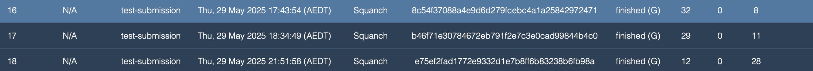
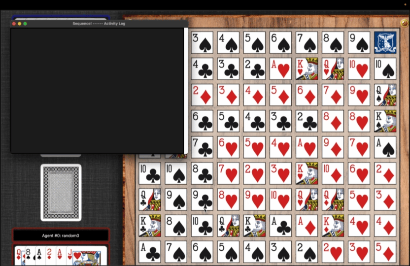
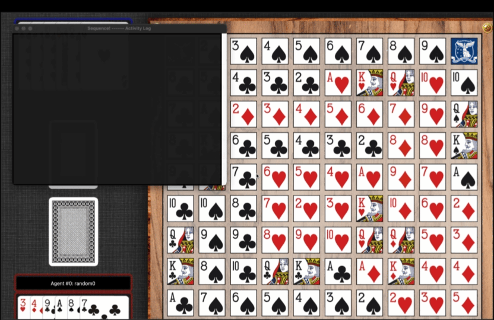
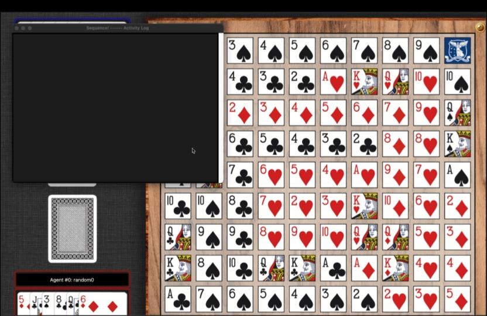

# Experiments and Analysis

You can include screenshots of precompetition results and animated gifs, to showcase the evolution of your agents.


# Table of Contents
  * [Benchmark](#experiments)
  * [Experiments AI Method 1 - Computational Approach](#ai-method-1---computational-approach)
  * [Experiments AI Method 2 - SARSA](#experiments-ai-method-2---sarsa)
  * [Analysis](#analysis)
    - [AI Method 1 Computational Approach](#experiments-ai-method-1---computational-approach)
    - [AI Method 2 SARSA](#ai-method-2---sarsa)


## Experiments


The benchmarking protocol evaluates each agent by playing 1000 games against three predefined benchmark agents. Each benchmark represents a different level of strategy:

```
benchmark1.py: Greedy next-step agent with no defensive moves.

benchmark2.py: Greedy next-step agent that incorporates basic defence.

benchmark3.py: Greedy next-step agent with defence plus a heat map positional weighting strategy.
```

This setup allows for a systematic comparison of learning agents under progressively stronger opponents.

### Experiments AI Method 1 - Computational Approach

| AI Method 1 - Computational Approach | Vs benchmark1 | Vs benchmark2 | Vs benchmark3 | tag submission          | tag tournament-submission |
|------------------------|---------------|---------------|---------------|-------------------------|--------------------------|
|                        | 96.70%        | 62.70%        | 53.00%        | win 33 / 32 / 32 / 34   | rank 23                  |


### Experiments AI Method 2 - SARSA

Hyper parameter: (alpha=0.3, gamma=0.9, epsilon=0.1)

| AI Method 2 - SARSA versus agents | train num | train win rate | VS benchmark3 | tag test submission |
|-----------------------------------|-----------|----------------|---------------|---------------------|
| random                            | 500       | 99%            | 46%           | NA                  |
| greedy with no defend             | 1000      | 47.75%         | 54%           | NA                  |
| greedy with defend                | 1000      | 54%            | 50%           | win 32              |
| greedy with defend                | 1000      | 33%            | 37%           | win 29              |
| greedy with defend                | 1000      | 35%            | 41%           | win 12              |

Q table length: 83543




Hyper parameter: (alpha=0.2, gamma=0.6, epsilon=0.1)

| AI Method 2 - SARSA versus agents | train num | train win rate | VS benchmark3 | tag test submission |
|-----------------------------------|-----------|----------------|---------------|---------------------|
| random                            | 500       | 99%            | 52%           | NA                  |
| greedy with no defend             | 800       | 65.88%         | 46%           | NA                  |
| greedy with defend                | 800       | 40%            | 47%           | win 31              |

Q table length: 30175

Tournament results: 29


### Experiment 2


### ...


## Analysis

### AI Method 1 - Computational Approach

##### 1. Adversarial strategy

Although the winning condition in Sequence is essentially the same as in Gomoku (forming a line of five pieces), the card-based randomness in Sequence prevents players from placing tokens freely. Combined with a significantly smaller board size compared to traditional Gomoku, this makes central control far more critical. Additionally, the “heart of the board” win condition—which grants an instant win if both centers are occupied—further amplifies the value of central control. Based on this insight, I hypothesized that early-game advantage in Sequence matters more than in most traditional placement games.

Therefore, I designed a scoring heuristic based on Goal Recognition techniques, using line-formation scores as guidance. To strengthen central control, I applied a concentric positional weighting scheme: actions closer to the center received much higher base scores, and the scores decayed gradually as they radiated outward. This approach encouraged aggressive control of the central region from the beginning of the game.

##### 2. Model tuning and implementation method changes

Over the course of developing my computational approach, I performed more than 40 rounds of tuning and tested the agent in over 50,000 self-play matches. Key adjustments included:

-- Increasing or decreasing defensive weights,

-- Shifting from purely line-counting to sequence-based analysis,

-- Reworking Jack usage strategy for both types,

-- Redesigning the heatmap and score propagation logic,

-- And tuning the balance between short-term combos and long-term positional strength.

One effective experiment involved amplifying central control further: if the initial hand was weak, I deliberately ignored weaker two-in-a-row chains outside the center and multiplied central heatmap values by 8.2. This pushed the model to always prefer inner moves. While this approach increased win rate by ~5% in mirror matches, it made the model overly rigid and vulnerable to edge-play strategies, dropping its average wins in the final test environment to only ~28 per 40 games.

Interestingly, adding complex defensive logic (such as multi-threat blocking) reduced overall win rate. Although intuitively promising, it consumed decision slots better used for proactive expansion. Due to Sequence's tight board space and limited card options, my experiments showed that aggression consistently outperformed passive defense. The final model saw a significant and counterintuitive boost after I stripped away many over-engineered defensive rules.


##### 3. Analysis of Results

Large-scale testing revealed that going first confers an average 55:45 win advantage under symmetric models. This further highlights the importance of strong opening strategies and central board control. To counter this imbalance, I reduced unnecessary defense and only enabled removal with jh/js in response to strong threats (4-in-a-row or draft-enabled 5-in-a-row).

Against high-difficulty benchmark agents—including one capable of an 8/10 win rate in Assignment 1—I found that more flexible behavior yielded better generalization. Allowing the agent to occasionally "bend the rules" (e.g., not always blocking a 3-chain) led to better overall adaptability and improved second-player win rate. This reinforces the importance of designing agents that are not just optimal in fixed scenarios, but also robust under variance.

### AI Method 2 - SARSA

##### 1. Impact of Hyperparameters and Training Strategy

The performance of the SARSA model depends on the setting of key hyperparameters: learning rate (alpha), discount factor (gamma), and exploration rate (epsilon).

- Alpha (learning rate) controls how much new experience updates the Q-table. 

- Gamma (discount factor) determines how much the agent values future rewards.

- Epsilon (exploration rate) balances exploration of new actions and exploitation of known best actions. Non-zero epsilon leads to persistent exploration, often resulting in lower training win rates.

Training uses a curriculum learning approach, starting with the weakest (random) opponents and then progressively training against stronger reward-shaped greedy agents. Due to the non-zero epsilon, the agent continues to explore and overall training win rates remain modest.

##### 2. Experimental Results

- First Training Run:
With a high alpha (0.3) and gamma (0.9), the Q-table grew rapidly, eventually exceeded 80,000 entries. However, when the agent was trained further against stronger “greedy with defend” opponents, its performance against benchmark3 declined (server win count dropped from 32 to 12). This suggests the agent did not generalise well to diverse strategies and have overfited.

- Second Training Run:
With a reduced alpha (0.2), gamma (0.6), and fewer training rounds (800 per agent), the Q-table shrank to about 30,000 entries. Generalisation improved, with win rates against benchmark3 rising to a maximum of 47%, and a best tournament ranking of 29. Although more stable than the first run, overall win rates remained limited.

##### 3. Analysis of Results

- Generalisation Gains and Limitations:
Feature engineering dramatically reduces the size of the state space, enabling a small training sample to generalise across many situations. However, this abstraction also leads to significant information loss. 

- Curriculum Learning and Limited Teacher Diversity:
Curriculum learning helps the agent learn incrementally, but training exclusively against greedy-based methods limits generalisation. Exposure to a wider range of strategies would likely improve robustness.

- SARSA’s Inherent Limitation:
SARSA updates Q-values based only on the next action, which may prevent the agent from capturing long-term strategic dependencies that span several moves.

- Q-table Update and Feature Loss:
As training progresses, the Q-table fails to converge to better strategies and can even degrade. This is likely because feature engineering omits too much critical information, leading to misinformed or misleading Q-value updates.


### Demo








